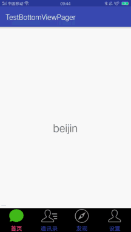

一 在project的build.gradle文件中的配置
---
- [参考链接](https://github.com/Kelin-Hong/MVVMLight)

- 演示
- 
- 代码如下
```
buildscript {
    repositories {
        jcenter()
    }
    dependencies {
        //noinspection GradleDependency
        classpath 'com.android.tools.build:gradle:2.3.3'
        //noinspection GradleDependency
        classpath 'me.tatarka:gradle-retrolambda:3.2.5'
        classpath 'com.github.dcendents:android-maven-gradle-plugin:1.4.1'
        classpath 'com.jfrog.bintray.gradle:gradle-bintray-plugin:1.6'
        //noinspection GradleDependency

    }
}

allprojects {
    repositories {
        jcenter()
        mavenCentral()
    }
}
```
二 在工程的module的build.gradle中的配置
---
- 注意：首先要把MVVMLight的lib导入工程中，并添加依赖，在SpaceLauncher中有Lib
```
apply plugin: 'me.tatarka.retrolambda'

在 dependencies{
 compile project(':library')
}

在android中添加
android{
dataBinding {
        enabled true
    }
    }
```
三 在使用时，建立布局对应的ViewModel
---
#### 1. ImageView
##### (1)其对应的布局文件
```
<layout xmlns:android="http://schemas.android.com/apk/res/android"
    xmlns:app="http://schemas.android.com/apk/res-auto"
    xmlns:tools="http://schemas.android.com/tools">

    <data>

        <variable
            name="viewModel"
            type="com.excellence.space.launcher.model.TopIconViewModel" />

    </data>
  <ImageView
                android:id="@+id/weather_image"
                android:layout_width="wrap_content"
                android:layout_height="wrap_content"
                android:layout_alignParentLeft="true"
                android:layout_alignParentTop="true"
                android:layout_marginRight="@dimen/margin_micro"
                android:src="@{viewModel.mWeatherImage}" />
</layout>
```
##### (2)建立布局对应的ViewModel
```
public class TopIconViewModel implements ViewModel{
    public final ObservableField<Drawable> mWeatherImage = new ObservableField<>();

public TopIconViewModel(Context context){
//当图片资源是本地图片时,初始化 ，图片会变得情况，如果图片不会变化，在布局中直接@drawable/xx即可
        mWeatherImage.set(context.getResources().getDrawable(R.drawable.weather_icon));

}
}
```
#### 2.TextView
##### (1)TextView对应的布局view的绑定,如果文字是不可变得，在布局中直接设android:text="@string/xx"即可；
- 注：textView可设置文字内容和typeFace
```
<layout xmlns:android="http://schemas.android.com/apk/res/android"
    xmlns:app="http://schemas.android.com/apk/res-auto"
    xmlns:tools="http://schemas.android.com/tools">

    <data>

        <variable
            name="viewModel"
            type="com.excellence.space.launcher.model.TopIconViewModel" />
            </data>
    <TextView
                android:id="@+id/city_text"
                android:layout_width="wrap_content"
                android:layout_height="wrap_content"
                android:layout_alignLeft="@+id/temp_text"
                android:layout_below="@+id/temp_text"
                android:text="@{viewModel.mCityText}"
                android:textColor="@android:color/white"
                android:textSize="@dimen/text_size_super_smaller"
                android:typeface="@{viewModel.mMainTypeface}" />

            </layot>
```
##### (2)TextView对应的ViewModel
```
public class TopIconViewModel implements ViewModel{
//将指定typeFace的文字格式文件放在assets/fonts/目录下
    public static final String TITLE_TYPEFACE = "fonts/Squ721Rm.ttf";

    //string
    public final ObservableField<String> mCityText = new ObservableField<>();

//typeFace

    public final ObservableField<Typeface> mMainTypeface = new ObservableField<>();

public TopIconViewModel(Context context){

 mCityText.set(mContext.getString(R.string.city_default));
         mMainTypeface.set(Typeface.createFromAsset(context.getAssets(), TITLE_TYPEFACE));

}
}

```
#### 3.RecyclerView
##### (1)在布局中的使用
```
<?xml version="1.0" encoding="utf-8"?>
<layout xmlns:android="http://schemas.android.com/apk/res/android"
    xmlns:app="http://schemas.android.com/apk/res-auto"
    xmlns:tools="http://schemas.android.com/tools">

    <data>

        <variable
            name="viewModel"
            type="com.excellence.space.launcher.model.settings.SettingViewModel"/>
        <import type="me.tatarka.bindingcollectionadapter2.LayoutManagers" />
    </data>

      <android.support.v7.widget.RecyclerView
            android:id="@+id/settings_list"
            android:layout_centerInParent="true"
            android:layout_width="wrap_content"
            android:layout_height="wrap_content"
             app:itemBinding="@{viewModel.mItemBinding}"
            app:items="@{viewModel.mItems}"/>

    </layout>
```
- 注 app:items="@{viewModel.mItems}" 数据源

-   app:itemBinding="@{viewModel.mItemBinding}"子布局模板
- app:layoutManager="@{LayoutManagers.grid(7)}"表示列表有七列
- app:layoutManager="@{LayoutManagers.linear()}"相当于listview类型的
##### (2)RecyclerView对应的viewModel
- 在对应的activity中调用viewModel时
```
public class SettingActivity extends BaseActivity<ActivitySettingsBinding> {
    private static final int SETTING_RECYCLER_VIEW_SPAN_COUNT = 4;
    private static final int DP_SETTING_RECYCLER_VIEW_SPACE = 6;

    @Override
    protected void onCreate(Bundle savedInstanceState) {
        super.onCreate(savedInstanceState);
        setContentView(R.layout.activity_settings);

        mBindingView.setVariable(BR.viewModel, new SettingViewModel(this));
        mBindingView.settingsList.setLayoutManager(new GridLayoutManager(this, SETTING_RECYCLER_VIEW_SPAN_COUNT));
        mBindingView.settingsList.addItemDecoration(new SpaceItemDecoration(DensityUtils.dp2px(this, DP_SETTING_RECYCLER_VIEW_SPACE)));
        mBindingView.settingsList.setFocusable(true);
        mBindingView.settingsList.requestFocus();
        new Handler().postDelayed(() -> mBindingView.settingsList.getChildAt(0).requestFocus(), Constants.SHORT_DELAY);
    }
}
```
- 对应的RecyclerView的viewmodel
```
public class SettingViewModel implements ViewModel{
    private Context mContext;

    public final ObservableList<AppItemViewModel> mItems = new ObservableArrayList<>();
    public final ItemBinding<AppItemViewModel> mItemBinding = ItemBinding.of(com.excellence.space.launcher.BR.viewModel, R.layout.layout_setting_item);


    public SettingViewModel(Context context){
        mContext = context;
        loadSettingItems();
    }

	private void loadSettingItems()
	{
		PlatformStrategy platformStrategy = new PlatformStrategy();
	 mItems.clear();
		Observable.from(platformStrategy.getSettingItemList()).subscribe(new Subscriber<AppItemInfo>()
		{
			@Override
			public void onCompleted()
			{

			}

			@Override
			public void onError(Throwable e)
			{

			}

			@Override
			public void onNext(AppItemInfo settingItemInfo)
			{
				 mItems.add(new AppItemViewModel(mContext, settingItemInfo));
			}
		});

	}
}
```
- AppItemViewModel为RecyclerView对应的item布局的viewModel
```
public class AppItemViewModel implements ViewModel
{
	private Context						mContext;
	private AppItemInfo mSettingItemInfo;
	public ObservableField<String>		mTitle	= new ObservableField<>();
	public ObservableField<Drawable>	mIcon	= new ObservableField<>();

	public AppItemViewModel(Context context, AppItemInfo settingItemInfo)
	{
		mSettingItemInfo = settingItemInfo;
		mContext = context;
		mTitle.set(mSettingItemInfo.getTitle());
		mIcon.set(mSettingItemInfo.getIcon());
	}

	public ReplyCommand mItemClickCommand = new ReplyCommand(() -> {
		try
		{
			if(mSettingItemInfo.getComponentName() != null){
				mContext.startActivity(new Intent().setComponent(mSettingItemInfo.getComponentName()));
			}else {
				mContext.startActivity(new Intent(mSettingItemInfo.getAction()));
			}
		}
		catch (Exception e)
		{
			Toast.makeText(mContext, mContext.getString(R.string.action_open_failed), Toast.LENGTH_SHORT).show();
		}

	});

}
```
- item布局里的数据绑定
```
<?xml version="1.0" encoding="utf-8"?>
<layout xmlns:android="http://schemas.android.com/apk/res/android"
        xmlns:app="http://schemas.android.com/apk/res-auto">

    <data>
        <variable
            name="viewModel"
            type="com.excellence.space.launcher.model.AppItemViewModel"/>
    </data>

    <LinearLayout
        android:layout_width="@dimen/setting_item_width"
        android:layout_height="@dimen/setting_item_height"
        android:background="@drawable/setting_item_selector"
        bind:clickCommand="@{viewModel.mItemClickCommand}"
        android:clickable="true"
        android:focusable="true"
        android:orientation="vertical">

        <ImageView
            android:id="@+id/image"
            android:layout_marginTop="@dimen/margin_normal"
            android:layout_gravity="center_horizontal"
            android:src="@{viewModel.mIcon}"
            android:layout_width="wrap_content"
            android:layout_height="wrap_content"/>

        <TextView
            android:id="@android:id/title"
            android:layout_width="wrap_content"
            android:layout_height="wrap_content"
            android:layout_gravity="center_horizontal"
            android:layout_marginTop="@dimen/margin_normal"
            android:text="@{viewModel.mTitle}"
            android:gravity="center"
            android:textSize="@dimen/text_size_super_little"
            android:textColor="@android:color/white"/>

    </LinearLayout>
</layout>

```
#### 4. HorizontalScrollView添加view的viewModel样式
##### (1)在布局中
```
<HorizontalScrollView
                android:id="@+id/horizontal_scrollview"
                android:layout_width="match_parent"
                android:layout_height="@dimen/main_menu_item_height"
                android:layout_alignParentTop="true"
                android:layout_centerHorizontal="true"
                android:layout_marginTop="@dimen/main_menu_margin_top"
                android:nextFocusDown="@+id/local_viewpager"
                android:scrollbars="none">

                <LinearLayout
                    android:id="@+id/main_menu_layout"
                    android:layout_width="match_parent"
                    android:layout_height="wrap_content"
                    android:layout_gravity="center"
                    android:orientation="horizontal"
                    tools:ignore="ScrollViewSize" />

            </HorizontalScrollView>
```
和平常一样
##### （2）在activity中添加view时
```
private void initMenuItemView() {
        PlatformStrategy platformStrategy = new PlatformStrategy();
        Typeface typeface = Typeface.createFromAsset(getAssets(), TITLE_TYPEFACE);
        //List数据源
        ArrayList<AppItemInfo> menuItemList = platformStrategy.getMenuItemList();
        for (int i = 0; i < menuItemList.size(); i++) {
            MainMenuItemBinding mMenuItemBinding = DataBindingUtil.inflate(getLayoutInflater(), R.layout.main_menu_item, null, false);
            mMenuItemBinding.setVariable(BR.viewModel, new MenuItemViewModel(this, menuItemList.get(i)));
            mMenuItemBinding.menuText.setTypeface(typeface);
            mBindingView.mainMenuLayout.addView(mMenuItemBinding.getRoot());
        }
    }
```
##### (3)addview对应view的viewModel
```
public class MenuItemViewModel implements ViewModel {
	private Context							mContext			= null;
	private AppItemInfo mMenuItemInfo		= null;
	public final ObservableField<Drawable>	mMenuIcon			= new ObservableField<>();
	public final ObservableField<String>	mMenuTitle			= new ObservableField<>();

	public MenuItemViewModel(Context context, AppItemInfo menuItemInfo) {
		this.mContext = context;
		this.mMenuItemInfo = menuItemInfo;
		mMenuIcon.set(menuItemInfo.getIcon());
		mMenuTitle.set(menuItemInfo.getTitle());
	}

	public ReplyCommand mItemClickCommand = new ReplyCommand(() -> {
		try {
			try
			{
				if(mMenuItemInfo.getComponentName() != null){
					mContext.startActivity(new Intent().setComponent(mMenuItemInfo.getComponentName()));
				}else {
					mContext.startActivity(new Intent(mMenuItemInfo.getAction()));
				}
			}
			catch (Exception e)
			{
				Toast.makeText(mContext, mContext.getString(R.string.action_open_failed), Toast.LENGTH_SHORT).show();
			}
		} catch (Exception e) {
			e.printStackTrace();
		}

	});
}
```
##### （4）item对应的layout数据及点击事件的绑定
```
<?xml version="1.0" encoding="utf-8"?>
<layout xmlns:android="http://schemas.android.com/apk/res/android"
        xmlns:app="http://schemas.android.com/apk/res-auto">
    <data>
        <variable name="viewModel" type="com.excellence.space.launcher.model.MenuItemViewModel"/>
    </data>

    <RelativeLayout
        android:layout_width="match_parent"
        android:layout_height="match_parent">

        <RelativeLayout
            android:id="@+id/menu_item_layout"
            android:layout_width="match_parent"
            android:layout_height="match_parent"
            android:background="@drawable/main_menu_item_selector"
            android:clickable="true"
            android:focusable="true"
            app:clickCommand="@{viewModel.mItemClickCommand}">

            <ImageView
                android:id="@+id/menu_image"
                android:layout_width="wrap_content"
                android:layout_height="wrap_content"
                android:layout_centerVertical="true"
                android:layout_marginLeft="@dimen/margin_normal"
                android:src="@{viewModel.mMenuIcon}"/>

            <TextView
                android:id="@+id/menu_text"
                android:layout_width="@dimen/main_menu_text_width"
                android:layout_height="@dimen/main_menu_text_height"
                android:layout_alignParentBottom="true"
                android:layout_alignParentRight="true"
                android:gravity="center"
                android:text="@{viewModel.mMenuTitle}"
                android:textColor="@android:color/white"
                android:textSize="@dimen/text_size_micro"/>

        </RelativeLayout>

        <ImageView
            android:layout_width="@dimen/margin_micro"
            android:layout_height="match_parent"
            android:layout_toRightOf="@+id/menu_item_layout"/>
    </RelativeLayout>
</layout>
```
#### 5.Viewpager的用法和RecyclerView的类似，分别绑定数据和item,创建Viewmodel.
#### 6.ViewPager和RecyclerView结合使用，实现翻页，将数据一层层传入即可。
##### (1)在布局中
```
<?xml version="1.0" encoding="utf-8"?>
<layout xmlns:android="http://schemas.android.com/apk/res/android"
    xmlns:app="http://schemas.android.com/apk/res-auto"
    xmlns:tools="http://schemas.android.com/tools">

    <data>

        <variable
            name="viewModel"
            type="com.excellence.space.launcher.model.TopIconViewModel" />

    </data>

     <android.support.v4.view.ViewPager
                android:id="@+id/local_viewpager"
                android:layout_width="wrap_content"
                android:layout_height="@dimen/local_viewpager_height"
                android:layout_below="@+id/divider_line"
                android:layout_marginTop="@dimen/margin_micro"
                android:nextFocusDown="@+id/arrow_left_image"
                app:itemBinding="@{viewModel.mViewPagerItemBinding}"
                app:items="@{viewModel.mViewPagerItems}" />
    </layout>
```
##### (2)在代码中创建ViewPager对应的viewModel
```
public class TopIconViewModel implements ViewModel{
private Context mContext=null;

//数据源
 public final ObservableList<ViewPagerItemViewModel> mViewPagerItems = new ObservableArrayList<>();
//Viewpager对应的item,及布局，该布局里放RecyclerView
    public final ItemBinding<ViewPagerItemViewModel> mViewPagerItemBinding = ItemBinding.of(BR.viewModel, R.layout.layout_viewpager_item);

public TopIconViewModel(Context context){
this.mContext=context;
//通过广播刷新数据
 Messenger.getDefault().register(mContext, Constants.APP_REFRESH, () -> {
            Log.e(TAG, "load()");
            load();
        });
}

public void load() {
        mViewPagerItems.clear();
        mPageCount = (int) Math.ceil((float) getAppItemList().size() / APP_ITEM_NUM_COLUMNS);
        for (int i = 0; i < mPageCount; i++) {
        //将每一页的数据传到ItemViewmodel里，即Recyclerview的viewModel里
            mViewPagerItems.add(new ViewPagerItemViewModel(mContext, getOnePageList(7, i * 7)));
        }
    }
//得到总列表数据
    private List<HotAppInfo> getAppItemList() {
        List<HotAppInfo> mAddedAppsList = AppDBManager.obtain(mContext).getAllAddedAppItemsByType(HotAppInfo.TYPE_MAIN);
        //这里多添加了最后一个位置，用于放不同的item
        HotAppInfo addOrDeleteItem = new HotAppInfo();
        addOrDeleteItem.setName(null);
        addOrDeleteItem.setType(HotAppInfo.TYPE_MAIN);
        mAddedAppsList.add(addOrDeleteItem);
        return mAddedAppsList;
    }
//得到每一页的数据
    private ArrayList<HotAppInfo> getOnePageList(long num, long index) {
        ArrayList<HotAppInfo> onePageList = new ArrayList<>();
        int count = NUM_ZERO;
        Log.e(TAG, getAppItemList().size() + "");
        for (HotAppInfo appItemInfo : getAppItemList()) {
            if (count >= index) {
                onePageList.add(appItemInfo);
            }
            if (onePageList.size() == num) {
                break;
            }
            count++;
        }
        return onePageList;
    }

}
```
##### (3)ViewPager的Item对应的ViewModel,即RecyclerView的viewModel
- 注item的布局文件内容如下：
```
<?xml version="1.0" encoding="utf-8"?>
<layout xmlns:android="http://schemas.android.com/apk/res/android"
    xmlns:app="http://schemas.android.com/apk/res-auto">

    <data>

        <variable
            name="viewModel"
            type="com.excellence.space.launcher.model.ViewPagerItemViewModel" />

        <import type="me.tatarka.bindingcollectionadapter2.LayoutManagers" />
    </data>

    <RelativeLayout
        android:layout_width="match_parent"
        android:layout_height="match_parent">

        <android.support.v7.widget.RecyclerView
            android:id="@+id/add_recycler"
            android:layout_width="match_parent"
            android:layout_height="match_parent"
            app:items="@{viewModel.mItems}"
            app:itemBinding="@{viewModel.mOnItemBind}"
            app:layoutManager="@{LayoutManagers.grid(7)}" />

    </RelativeLayout>
</layout>
```
- Viewpager的Item对应的viewmodel代码部分
```
public class ViewPagerItemViewModel implements ViewModel {

    private Context mContext = null;
    private static final int VIEW_TYPE = 2;
    private ArrayList mAppItemList = null;

    public final ObservableList<AddLocalItemViewModel> mItems = new ObservableArrayList<>();
    public final OnItemBind<AddLocalItemViewModel> mOnItemBind = (itemBinding, position, item) -> itemBinding.set(BR.viewModel,  item.mTitle.get() == null ? R.layout.add_or_delete_item
            : R.layout.add_local_app_item);

//将每一页的List数据传进来
    public ViewPagerItemViewModel(Context context, ArrayList appItemList) {
        this.mContext = context;
        this.mAppItemList = appItemList;

        loadAppsItems();
    }

    private void loadAppsItems() {
        mItems.clear();
        Observable.from(mAppItemList).subscribe(new Subscriber<HotAppInfo>() {
            @Override
            public void onCompleted() {

            }

            @Override
            public void onError(Throwable e) {

            }

            @Override
            public void onNext(HotAppInfo hotAppInfo) {
                 mItems.add(new AddLocalItemViewModel(mContext, hotAppInfo));
            }
        });

    }

}
```
##### (4)RecyclerView对应的item ,及每一个item的ViewModel
- 代码部分
```
public class AddLocalItemViewModel implements ViewModel {

    private Context mContext = null;
    private HotAppInfo mAppInfo = null;
    @SuppressWarnings("FieldCanBeLocal")
    private Drawable mDrawable = null;
    public ObservableField<String> mTitle = new ObservableField<>();
    public ObservableField<Drawable> mIcon = new ObservableField<>();

    public AddLocalItemViewModel(Context context, HotAppInfo hotAppInfo) {
        mAppInfo = hotAppInfo;
        mContext = context;
        mTitle.set(mAppInfo.getName());
        try {
            mDrawable = mContext.getPackageManager().getApplicationInfo(mAppInfo.getPackageName(), 0).loadIcon(mContext.getPackageManager());
            mIcon.set(mDrawable);
        } catch (PackageManager.NameNotFoundException e) {
            e.printStackTrace();
        }
    }

    public ReplyCommand mItemClickCommand = new ReplyCommand(() -> {
        if(mAppInfo.getName() != null){
            try {
                Intent intent = mContext.getPackageManager().getLaunchIntentForPackage(mAppInfo.getPackageName());
                if (intent != null) {
                    mContext.startActivity(intent);
                }
            } catch (Exception e) {
                Toast.makeText(mContext, mContext.getString(R.string.action_open_failed), Toast.LENGTH_SHORT).show();
            }
        }else {
            BottomAddWindow bottomAddWindow = new BottomAddWindow(mContext,mAppInfo.getType());
            bottomAddWindow.show();
        }
    });
}

```
- 布局item绑定数据和点击事件
```
<?xml version="1.0" encoding="utf-8"?>
<layout xmlns:android="http://schemas.android.com/apk/res/android"
        xmlns:app="http://schemas.android.com/apk/res-auto">
    <data>
        <variable name="viewModel"
                  type="com.excellence.space.launcher.model.AddLocalItemViewModel"/>
    </data>

        <RelativeLayout
            android:id="@+id/add_item_layout"
            android:layout_width="@dimen/local_viewpager_height"
            android:layout_height="@dimen/local_viewpager_height"
            app:clickCommand="@{viewModel.mItemClickCommand}"
            android:background="@drawable/app_item_selector"
            android:clickable="true"
            android:focusable="true">

            <ImageView
                android:id="@+id/local_app_icon"
                android:layout_width="@dimen/apk_icon_width"
                android:layout_height="@dimen/apk_icon_height"
                android:src="@{viewModel.mIcon}"
                android:layout_centerHorizontal="true"
                android:layout_marginTop="@dimen/margin_super_little"/>

            <TextView
                android:id="@+id/local_app_name"
                android:layout_width="wrap_content"
                android:layout_height="wrap_content"
                android:layout_below="@+id/local_app_icon"
                android:layout_centerHorizontal="true"
                android:layout_marginTop="@dimen/margin_super_little"
                android:text="@{viewModel.mTitle}"
                android:textColor="@android:color/white"
                android:textSize="@dimen/text_size_micro"/>

        </RelativeLayout>

</layout>
```
四 关于点击事件
---
#### 1.单独控件的点击事件，在布局中用对应viewmodel的点击事件即可，至于其它的点击事件与其类似
app:clickCommand="@{viewModel.mBtnRightClickCommand}"
```
 public ReplyCommand mBtnLeftClickCommand = new ReplyCommand(() -> mLocalViewPager.setCurrentItem(mCurrentPosition > NUM_ZERO ? --mCurrentPosition : mCurrentPosition));

    public ReplyCommand mBtnRightClickCommand = new ReplyCommand(() -> mLocalViewPager.setCurrentItem(mPageCount > NUM_ONE ? ++mCurrentPosition : mCurrentPosition));
```
五 关于广播
---
- 注：注：###
```
1、Messenger 一定要取消注册，不然会造成严重的内存泄露
2、Messenger 的TOKEN在命名的时候要注意，最好和相关的ViewModel结合起来，避免在同一个App出现两个相同的Token，这样会把消息发到其他你不知道的地方，造成潜在的BUG！
```
#### 1.使用的demo, 监听U盘的广播,新建一个广播类
```
public class UsbConnectBroadcastReceiver extends BroadcastReceiver {
	public final static String	USB_MOUNT	= "android.intent.action.MEDIA_MOUNTED";
	public final static	String USB_UNMOUNTED = "android.intent.action.MEDIA_UNMOUNTED";

	@Override
	public void onReceive(Context context, Intent intent) {
		if (Objects.equals(intent.getAction(), USB_MOUNT) || Objects.equals(intent.getAction(), USB_UNMOUNTED)) {
			Messenger.getDefault().sendNoMsg(intent.getAction());
		}
	}
}

```
#### 2.在清单文件中调用
```
 <receiver android:name=".broadcast.UsbConnectBroadcastReceiver">
            <intent-filter android:priority="1000">
                <action android:name="android.intent.action.MEDIA_MOUNTED" />
                <action android:name="android.intent.action.MEDIA_UNMOUNTED" />
                <data android:scheme="file" />
            </intent-filter>
        </receiver>
```
#### 3.在对应的viewmodel的构造方法或者自定义的onCreate里注册（在activity的onCreate方法里调用自定义的oncreate方法)
```
Messenger.getDefault().register(mContext, UsbConnectBroadcastReceiver.USB_MOUNT, () -> {
            Log.e(TAG, "USB_MOUNT");
            //执行动作
            refreshUsbItem(true);
        });
        Messenger.getDefault().register(mContext, UsbConnectBroadcastReceiver.USB_UNMOUNTED, () -> {
            Log.e(TAG, "USB_UNMOUNTED");
            //执行动作
            refreshUsbItem(false);
        });
```
  #### 4.取消注册
  - 在activity的onDestroy方法里取消
  - 或者在viewmodel里自定义onDestroy方法，在activity的onDestroy()方法里调用,具体代码如下：
 ```
  public void onDestroy() {

        Messenger.getDefault().unregister(mContext, UsbConnectBroadcastReceiver.USB_MOUNT);
        Messenger.getDefault().unregister(mContext, UsbConnectBroadcastReceiver.USB_UNMOUNTED);
    }
 ```
 六 关于Viewpager不同页面的使用
---
- 使用demo参考 /e盘/git/TestBottomViewPager
### 1.在布局中Viewpager的使用
```
<?xml version="1.0" encoding="utf-8"?>
<layout xmlns:android="http://schemas.android.com/apk/res/android"
    xmlns:app="http://schemas.android.com/apk/res-auto">

    <data>

        <variable
            name="viewModel"
            type="com.example.liye.testbottomviewpager.model.MainViewModel" />
    </data>

    <RelativeLayout
        android:layout_width="match_parent"
        android:layout_height="match_parent">

        <android.support.v4.view.ViewPager
            android:id="@+id/vp_content"
            android:layout_width="match_parent"
            android:layout_height="match_parent"
            android:background="#ffffff"
            app:itemBinding="@{viewModel.mItemBinding}"
            app:items="@{viewModel.mItems}"/>

            </RelativeLayout>
    </layout>
```

### 2.建立ViewPager对应的ViewModel
```
public class MainViewModel implements ViewModel {

    private Context mContext = null;
    public final ObservableList<ViewPagerItemViewModel> mItems = new ObservableArrayList<>();
    //有多少页就绑定多少个布局
    public final OnItemBind<ViewPagerItemViewModel> mItemBinding = (itemBinding, position, item) -> itemBinding.set(BR.viewModel, position == 0 ? R.layout.page_item_one : position == 1 ? R.layout.page_item_two : position == 2 ? R.layout.page_item_three : position == 3 ? R.layout.page_item_four : R.layout.page_item_one);

     public MainViewModel(Context context) {
        this.mContext = context;
        loadItemList();
    }

    private void loadItemList() {
        mItems.clear();

        int mPageCount = 4;
        for (int i = 0; i < mPageCount; i++) {
            ItemInfo itemInfo = new ItemInfo();
            itemInfo.setId(i);
            mItems.add(new ViewPagerItemViewModel(mContext, itemInfo));

        }

    }
}
```
### 3.建立各个布局对应的公共的pagerItemViewModel
```
public class ViewPagerItemViewModel implements ViewModel {

    private Context mContext = null;
    public final ObservableList<TwoPageItemViewModel> mItems = new ObservableArrayList<>();
    public final ItemBinding<TwoPageItemViewModel> mItemBinding = ItemBinding.of(BR.viewModel, R.layout.item_page_two);


    public ObservableField<String> mContent = new ObservableField<>();
    public ObservableField<String> mEditText = new ObservableField<>();

    public ViewPagerItemViewModel(Context context, ItemInfo itemInfo) {
        this.mContext = context;
        if (itemInfo.getId() == 0) {
            mEditText.set(null);
            initOnePage();
        } else if (itemInfo.getId() == 1) {
            initTwoPage();
        }
    }


    private void initOnePage() {
        mContent.set("beijin");

    }

    private void initTwoPage() {
        mItems.clear();
        Observable.from(getTwoItemList()).subscribe(new Subscriber<TwoItemInfo>() {
            @Override
            public void onCompleted() {

            }

            @Override
            public void onError(Throwable e) {

            }

            @Override
            public void onNext(TwoItemInfo settingItemInfo) {
                mItems.add(new TwoPageItemViewModel(mContext, settingItemInfo));
            }
        });

    }

    private List<TwoItemInfo> getTwoItemList() {
        ArrayList<TwoItemInfo> topItemInfoList = new ArrayList<>();

        Resources res = mContext.getResources();
        TypedArray menuIconArray = res.obtainTypedArray(R.array.top_title_icon_array);
        String[] menuTitleArray = res.getStringArray(R.array.main_menu_title_array);
        for (int i = 0; i < menuIconArray.length(); i++) {

            TwoItemInfo appItemInfo = new TwoItemInfo();
            appItemInfo.setIcon(menuIconArray.getDrawable(i));
            appItemInfo.setTitle(menuTitleArray[i]);

            topItemInfoList.add(appItemInfo);
        }
        menuIconArray.recycle();
        return topItemInfoList;
    }

    public final ReplyCommand<String> textWatcher = new ReplyCommand<>((s) -> {
        if (s == null || "".equals(s)) {
//            setListDataByStringList();
        } else {
            getEditText(s);
        }
    });

    private void getEditText(String s){
        Toast.makeText(mContext,s,Toast.LENGTH_LONG).show();
    }
}

```
### 4.对应不同item的布局，举例
- 注：page_item_one ，包括了EditText的双向绑定
```
<?xml version="1.0" encoding="utf-8"?>
<layout xmlns:android="http://schemas.android.com/apk/res/android"
    xmlns:tools="http://schemas.android.com/tools"
    xmlns:app="http://schemas.android.com/apk/res-auto">

    <data>

        <variable
            name="viewModel"
            type="com.example.liye.testbottomviewpager.model.ViewPagerItemViewModel" />
    </data>

    <RelativeLayout
        android:layout_width="match_parent"
        android:layout_height="match_parent"
         >

        <TextView
        android:layout_width="wrap_content"
        android:layout_height="wrap_content"
        android:layout_centerInParent="true"
        android:text="@{viewModel.mContent}"
        android:textSize="30dp" />

        <EditText
            android:id="@+id/edit_text"
            android:layout_alignParentBottom="true"
            android:text="@{viewModel.mEditText}"
            app:afterTextChangedCommand="@{viewModel.textWatcher}"
            android:layout_width="wrap_content"
            android:layout_height="wrap_content" />
    </RelativeLayout>
</layout>
```
- 注：page_item_two ,ViewPager的item也可以用ListView等
```
<?xml version="1.0" encoding="utf-8"?>
<layout xmlns:android="http://schemas.android.com/apk/res/android"
    xmlns:app="http://schemas.android.com/apk/res-auto"
    xmlns:tools="http://schemas.android.com/tools">

    <data>

        <variable
            name="viewModel"
            type="com.example.liye.testbottomviewpager.model.ViewPagerItemViewModel" />
    </data>

    <RelativeLayout
        android:layout_width="match_parent"
        android:layout_height="match_parent">

        <GridView
            android:id="@+id/gridview"
            android:layout_width="match_parent"
            android:layout_height="wrap_content"
            android:horizontalSpacing="15dp"
            android:numColumns="2"
            android:verticalSpacing="15dp"
            app:itemBinding="@{viewModel.mItemBinding}"
            app:items="@{viewModel.mItems}" />
    </RelativeLayout>
</layout>
```